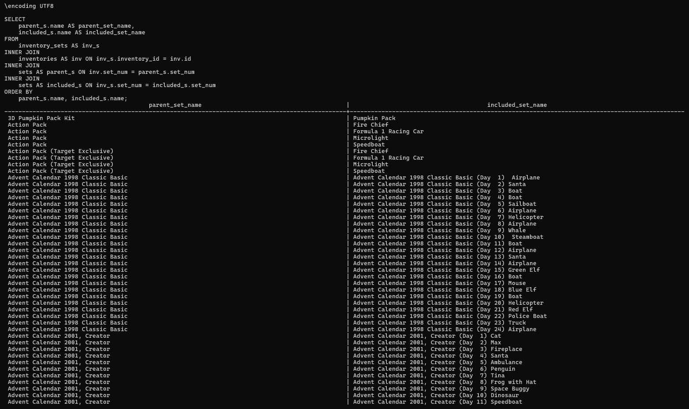

# Part 2. Writing your SQL
### You can visit the github repo [here](https://github.com/ykc2486/DB_HW1) to see the code files.

## Question 1

### 503 rows returned
---
## Question 2

### 5 rows returned
---
## Question 3

### 2846 rows returned
---
## Question 4

### 698 rows returned
---
## Question 5

### 7 rows returned
---
## Question 6

### 1 row returned
---
## Question 7

### 296 rows returned
---
## Question 8

### 39 rows returned

---
## Question 9

### 5 rows returned
---
## Bonus 1

### 3 rows returned
---
## Bonus 2

### 1 row returned