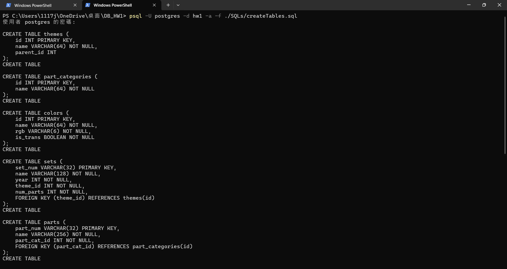

## Part 1. Import Data

### Step 1: Understand the database schema and relationships
Decide each tables' primary key and foreign key. And we should **firstly import the tables that do not have foreign keys.**
So I will import the tables in the following order: 
1. **Table: themes**
    - Primary Key: id
    - Foreign Key: None
2. **Table: part_categories**
    - Primary Key: id
    - Foreign Key: None
3. **Table: colors**
    - Primary Key: id
    - Foreign Key: None
4. **Table: sets**
    - Primary Key: id
    - Foreign Key: theme_id **(references themes.id)**
5. **Table: parts**
    - Primary Key: id
    - Foreign Key: part_cat_id **(references part_categories.id)**
6. **Table: inventories**
    - Primary Key: id
    - Foreign Key: set_num **(references sets.set_num)**
7. **Table: inventory_parts**
    - Primary Key: (inventory_id, part_num) **(composite key)**
    - Foreign Key: inventory_id **(references inventories.id)**
    - Foreign Key: part_num **(references parts.part_num)**
8. **Table: inventory_sets**
    - Primary Key: (inventory_id, set_num) **(composite key)**
    - Foreign Key: inventory_id **(references inventories.id)** 
    - Foreign Key: set_num **(references sets.set_num)**

### Step 2: Create tables in PostgreSQL

For each table, I will first use the `CREATE TABLE` statement to define the table structure. (See `createTables.sql` for details.)
For example, for the `sets` table, the SQL statement is as follows:
```sql
CREATE TABLE sets (
    set_num VARCHAR(32) PRIMARY KEY,
    name VARCHAR(128) NOT NULL,
    year INT NOT NULL,
    theme_id INT NOT NULL,
    num_parts INT NOT NULL,
    FOREIGN KEY (theme_id) REFERENCES themes(id)
);
```


Then, using:
```powershell
psql -U postgres -d hw1 -a -f ./SQLs/createTables.sql
```


---

### 1. `themes`

| Attribute   | Data Type     | Constraints          |
| ----------- | ------------- | -------------------- |
| `id`        | `INT`         | Primary Key          |
| `name`      | `VARCHAR(64)` | NOT NULL             |
| `parent_id` | `INT`         | Can be NULL          |

---

### 2. `part_categories`

| Attribute | Data Type     | Constraints |
| --------- | ------------- | ----------- |
| `id`      | `INT`         | Primary Key |
| `name`    | `VARCHAR(64)` | NOT NULL    |

---

### 3. `colors`

| Attribute  | Data Type     | Constraints          |
| ---------- | ------------- | -------------------- |
| `id`       | `INT`         | Primary Key          |
| `name`     | `VARCHAR(64)` | NOT NULL             |
| `rgb`      | `VARCHAR(6)`  | NOT NULL             |
| `is_trans` | `BOOLEAN`     | NOT NULL             |

---

### 4. `sets`

| Attribute   | Data Type      | Constraints                         |
| ----------- | -------------- | ----------------------------------- |
| `set_num`   | `VARCHAR(32)`  | Primary Key                         |
| `name`      | `VARCHAR(128)` | NOT NULL                            |
| `year`      | `INT`          | NOT NULL                            |
| `theme_id`  | `INT`          | NOT NULL，Foreign Key → `themes(id)` |
| `num_parts` | `INT`          | NOT NULL                            |

---

### 5. `parts`

| Attribute     | Data Type      | Constraints                                  |
| ------------- | -------------- | -------------------------------------------- |
| `part_num`    | `VARCHAR(32)`  | Primary Key                                  |
| `name`        | `VARCHAR(256)` | NOT NULL                                     |
| `part_cat_id` | `INT`          | NOT NULL，Foreign Key → `part_categories(id)` |

---

### 6. `inventories`

| Attribute | Data Type     | Constraints                            |
| --------- | ------------- | -------------------------------------- |
| `id`      | `INT`         | Primary Key                            |
| `version` | `INT`         | NOT NULL                               |
| `set_num` | `VARCHAR(32)` | NOT NULL，Foreign Key → `sets(set_num)` |

---

### 7. `inventory_parts`

| Attribute       | Data Type                            | Constraints                              |
| --------------- | ------------------------------------ | ---------------------------------------- |
| `inventory_id`  | `INT`                                | NOT NULL，Foreign Key → `inventories(id)` |
| `part_num`      | `VARCHAR(32)`                        | NOT NULL，Foreign Key → `parts(part_num)` |
| `color_id`      | `INT`                                | NOT NULL，Foreign Key → `colors(id)`      |
| `quantity`      | `INT`                                | NOT NULL                                 |
| `is_spare`      | `BOOLEAN`                            | NOT NULL                                 |
| **Primary Key** | `(inventory_id, part_num, color_id)` | composite primary key                                     |

---

### 8. `inventory_sets`

| Attribute       | Data Type                 | Constraints                              |
| --------------- | ------------------------- | ---------------------------------------- |
| `inventory_id`  | `INT`                     | NOT NULL，Foreign Key → `inventories(id)` |
| `set_num`       | `VARCHAR(32)`             | NOT NULL，Foreign Key → `sets(set_num)`   |
| `quantity`      | `INT`                     | NOT NULL                                 |
| **Primary Key** | `(inventory_id, set_num)` | composite primary key                                     |

---

### Step 3: Import data into tables
using the `COPY` command to import data from CSV files into the corresponding tables. (See `importData.sql` for details.)

